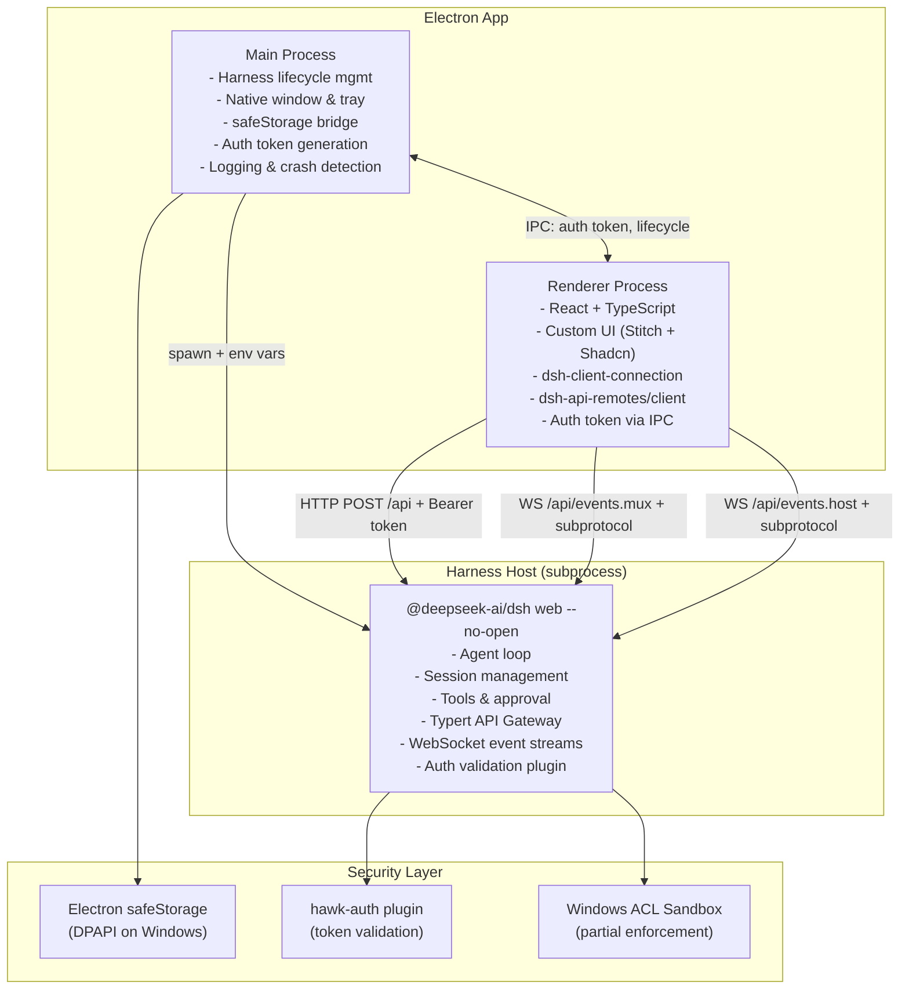

# HawkAIAgent Architecture

## System Overview



## Data Flow

### Chat Message Flow

```
User types message
    ↓
Renderer: HTTP POST /api { method: "session.send", params: { prompt, sessionId } }
    ↓
Harness: agent.followup() → agent loop claims prompt
    ↓
Harness: LLM stream → session event log
    ↓
Harness: WebSocket events.mux → ServerRequest frames
    ↓
Renderer: Display streaming response
```

### Tool Approval Flow

```
Harness: tool/call event → approval policy check
    ↓
WebSocket events.mux → tool_call frame with approval_required
    ↓
Renderer: Show approval dialog
    ↓
User clicks approve/reject
    ↓
Renderer: HTTP POST /api { method: "tool.approve", params: { callId, approved } }
    ↓
Harness: tools/execute or tools/reject
```

### Key Management Flow

```
User enters API key in Settings
    ↓
Renderer: IPC → Main process
    ↓
Main: safeStorage.encryptString(key) → write to disk
    ↓
On app start:
Main: safeStorage.decryptString(blob) → plaintext key
    ↓
Main: spawn harness with DEEPSEEK_API_KEY in env
    ↓
Harness: credentials-local reads env (priority 1)
```

## Component Responsibilities

| Component | Technology | Responsibilities |
|-----------|-----------|-----------------|
| Main Process | Electron + Node.js | Window management, Harness lifecycle, safeStorage, auth token, crash detection |
| Renderer | React + TypeScript + Tailwind | UI rendering, user interaction, API calls, event display |
| Harness Host | @deepseek-ai/dsh | Agent loop, session management, tools, approval, persistence |
| Auth Plugin | Cordis plugin | Token validation on HTTP and WebSocket |
| Sandbox | Windows ACL | File-effect confinement for agent tools |

## DSH_HOME

```
<app.getPath('userData')>/dsh-home/
├── profiles/           # Profile configurations
├── settings.yaml       # User settings
├── sessions/           # Session persistence (JSONL)
├── logs/               # Application logs
└── cordis.patch.yml    # Home-level patch layer
```

Completely isolated from `~/.dsh/` used by system `dsh` CLI.

## Security Boundaries

| Boundary | Protection | Limitation |
|----------|-----------|------------|
| Static key storage | safeStorage/DPAPI | Decrypted in memory at runtime |
| Runtime key passing | env var to subprocess | Same-UID processes can read env |
| Loopback API | hawk-auth token | Token in process memory |
| Browser trust | Host/Origin/sec-fetch-site | Not authentication |
| File effects | Windows ACL sandbox | Partial enforcement, no read restriction |
