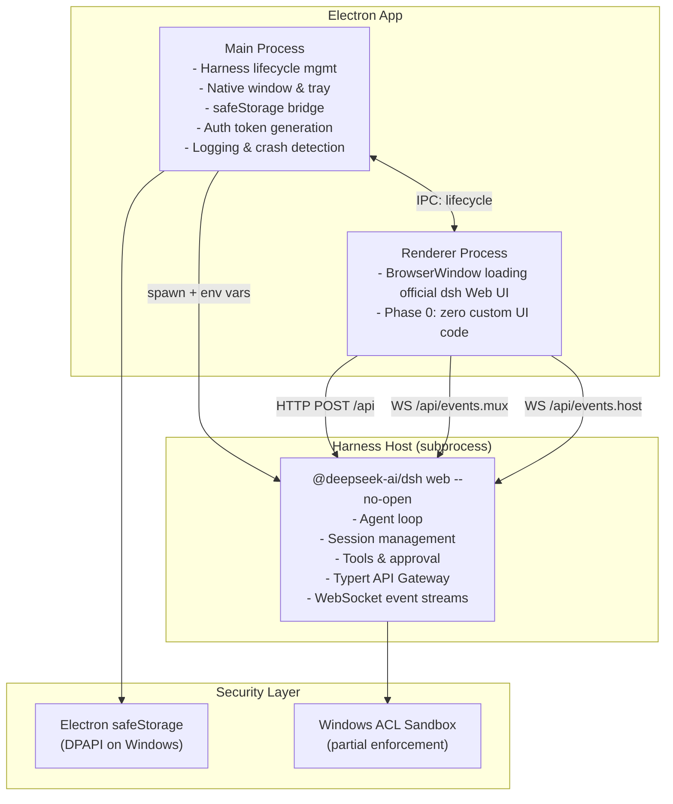

# HawkAIAgent Architecture

## System Overview (Phase 0)



## Data Flow

### Chat Message Flow

```
User types message in official Web UI
    ↓
Official UI: HTTP POST /api { method: "session.send", params: { prompt, sessionId } }
    ↓
Harness: agent.followup() → agent loop claims prompt
    ↓
Harness: LLM stream → session event log
    ↓
Harness: WebSocket events.mux → ServerRequest frames
    ↓
Official UI: Display streaming response
```

### Tool Approval Flow

```
Harness: tool/call event → approval policy check
    ↓
WebSocket events.mux → tool_call frame with approval_required
    ↓
Official UI: Show approval dialog
    ↓
User clicks approve/reject
    ↓
Official UI: HTTP POST /api { method: "tool.approve", params: { callId, approved } }
    ↓
Harness: tools/execute or tools/reject
```

### Key Management Flow

```
User enters API key in Settings
    ↓
Renderer: IPC → Main process
    ↓
Main: safeStorage.encryptString(key) → write to disk
    ↓
On app start:
Main: safeStorage.decryptString(blob) → plaintext key
    ↓
Main: spawn harness with DEEPSEEK_API_KEY in env
    ↓
Harness: credentials-local reads env (priority 1)
```

## Component Responsibilities

| Component | Technology | Responsibilities |
|-----------|-----------|-----------------|
| Main Process | Electron + Node.js | Window management, Harness lifecycle, safeStorage, crash detection |
| Renderer | BrowserWindow → official dsh Web UI | Phase 0: zero custom UI; loads upstream Web UI directly |
| Harness Host | @deepseek-ai/dsh | Agent loop, session management, tools, approval, persistence |
| Sandbox | Windows ACL | File-effect confinement for agent tools (partial enforcement) |

## DSH_HOME

```
<app.getPath('userData')>/dsh-home/
├── profiles/           # Profile configurations
├── settings.yaml       # User settings
├── sessions/           # Session persistence (JSONL)
├── logs/               # Application logs
└── cordis.patch.yml    # Home-level patch layer
```

Completely isolated from `~/.dsh/` used by system `dsh` CLI.

## Security Boundaries

| Boundary | Protection | Limitation |
|----------|-----------|------------|
| Static key storage | safeStorage/DPAPI | Decrypted in memory at runtime |
| Runtime key passing | env var to subprocess | Same-UID processes can read env |
| Loopback API | Random port + host allowlist | No auth middleware verified yet |
| Browser trust | Host/Origin/sec-fetch-site | Not authentication; fence only |
| File effects | Windows ACL sandbox | Partial enforcement, no read restriction |

## Future Candidate Architecture (Deferred / Unverified)

> **Route B: 自建 React UI + 官方客户端包** — 被 `window.__ModuleLoader__` 运行时依赖阻塞。
> Vite 构建可以产生 bundle，但浏览器运行时仍需要 `window.__ModuleLoader__`。
> 只能在 polyfill、转换插件或上游浏览器构建经过独立验证后重新评估。

如果 Route B 长期不可用，可重新评估 Route C（自建 BFF）。
