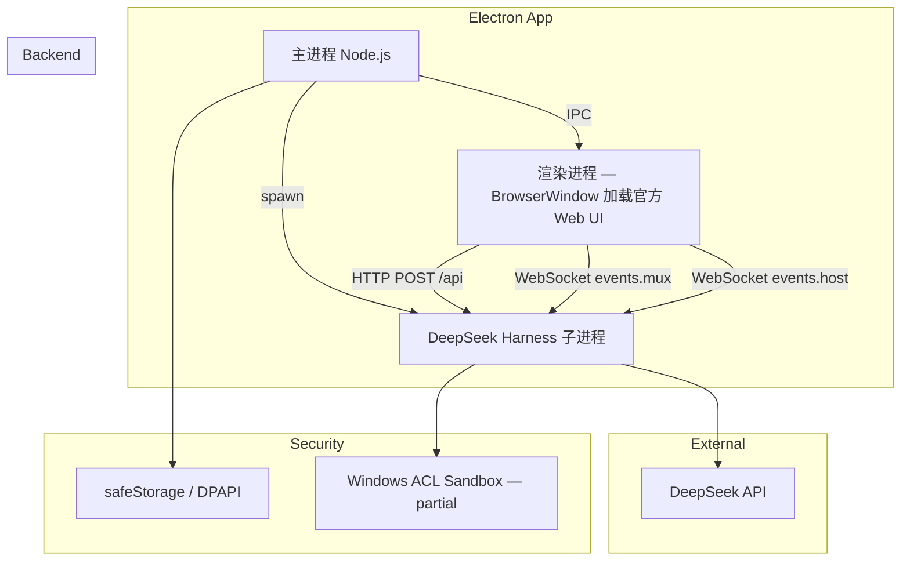

# Design Decisions

> Generated by Grill Me session — 2026-08-20
> **Updated: 2026-08-21 (G0-S1-R3 reconciliation)**

## Stage 1: Goal Alignment

- [x] **Core positioning:** AI Agent 工作台（C）
- [x] **Relationship with AImanhawk:** 独立全新项目，AImanhawk 废弃
- [x] **Target users:** 个人 → 小团队 → 公众（渐进式）
- [ ] **MVP scope:** Windows 11 x64, 单窗口, 单工作区, DeepSeek 单模型, 基础对话 + 工具 + 审批 + 生命周期管理
- [x] **Multi-model detail:** 不同 Agent 功能可设置不同模型（多模态、图片生成、视频生成等各自对应模型）— Deferred to Phase 2+
- [x] **Harness Web UI:** Route A — 加载官方 dsh Web UI（Phase 0 验证路线）

## Stage 2: Architecture

- [x] **Frontend framework:** React + TypeScript（product target, not Phase 0）
- [x] **UI generation:** Google Stitch SDK（设计阶段生成 HTML）→ 提取为 React + Tailwind 组件
- [x] **Component library:** Shadcn/ui + Tailwind CSS（Stitch 生成布局，Shadcn 补充交互组件）
- [x] **Harness integration:** 子进程 spawn（打包 Node.js 运行时）
- [x] **IPC protocol:** HTTP POST `/api` (Typert RPC) + WebSocket (`/api/events.mux`, `/api/events.host`) — 直接使用官方 Harness API，无需自建 BFF
- [x] **Harness startup:** 随 Electron 启动，关闭时终止子进程

## Stage 3: Boundaries & Risks

- [x] **API surface:** Harness Typert API Gateway 提供完整 HTTP RPC + WebSocket 事件流。**无需自建 BFF。** Route C 暂缓，除非发现 API 缺口。
- [x] **Tool execution security:** Windows ACL sandbox（部分执行）。Docker/E2B 作为可选增强，非 MVP 必需。
- [x] **API Key storage:** Electron safeStorage（DPAPI on Windows）— 主进程解密后通过环境变量传递给 Harness 子进程。不是强隔离，是暴露面缩减。
- [x] **Crash recovery:** 提示用户手动重启（B）

## Stage 4: Implementation Details

- [x] **Project structure:** Monorepo（pnpm workspace）— 主进程 / 渲染进程 两包（Phase 0 无需 BFF 包）
- [x] **Packaging tool:** electron-forge（Electron 官方推荐）
- [x] **Target platforms:** Windows first → Linux second → macOS last
- [x] **Node.js runtime:** 打包进应用，不依赖用户预装

## Current Integration Route (G0-S1 R3)

### Route A: Electron BrowserWindow 加载官方 dsh Web UI

**Status:** ✅ 当前唯一已知可用于 Windows 验证的路线

- Phase 0 验证路线：spawn `dsh web --no-open`，BrowserWindow 加载 `http://127.0.0.1:<port>`
- 零 UI 开发成本，最快验证路径
- 完全依赖上游 UI，无自定义能力

### Route B: 自建 React UI + 官方客户端包

**Status:** ⚠️ 暂缓 — 被 `window.__ModuleLoader__` 运行时依赖阻塞

- Vite 构建可以产生 bundle，但浏览器运行时仍需要 `window.__ModuleLoader__`
- Vite 构建成功 ≠ 浏览器运行成功
- 只能在 polyfill、转换插件或上游浏览器构建经过独立验证后重新评估

### Route C: 自建 BFF 包装 Harness API

**Status:** 暂缓 — 当前没有必要

- 如果 Route B 长期不可用，可以重新评估
- 不应写成永久否决

## Loopback Authentication

**Status:** Candidate / pending PoC — 不是最终安全设计

当前候选方案（需验证 Electron、官方 UI、HTTP RPC、WebSocket Upgrade 的实际兼容性）：

- 随机高位端口
- 仅绑定 127.0.0.1
- Host allowlist
- Origin allowlist
- HttpOnly session Cookie 候选（Cookie 按 Host/Domain/Path 匹配，**不按 TCP 端口隔离**）
- 严格 CSP
- `nodeIntegration: false` + `contextIsolation: true` + `sandbox: true`
- 独立 Electron session partition
- Token 每次启动重新生成
- 退出时清除 Cookie

> **注意：** 这些措施不构成强隔离。Harness 是否暴露可用的 HTTP middleware 和 WS upgrade hook 尚未验证。

## Architecture Overview (Phase 0)

## Next Steps

1. Run Windows PoC on Windows 11 x64 (G0-S1-R2-WIN Gate)
2. Verify Harness startup, readiness, WebSocket, and cleanup
3. If Gate passes: initialize monorepo structure (pnpm workspace)
4. Set up electron-forge with Route A (BrowserWindow loading official Web UI)
5. Implement Harness spawn + health check in main process
6. Design first screen (official Web UI or Stitch-generated layout)
