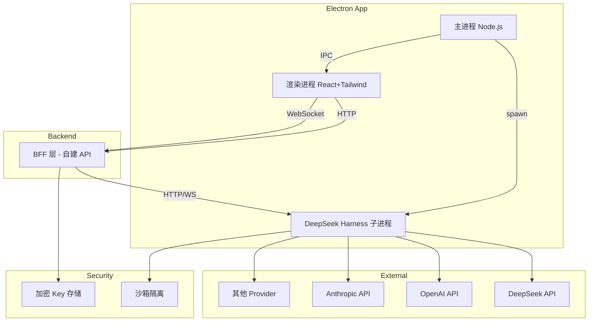

# Design Decisions

> Generated by Grill Me session — 2026-08-20

## Stage 1: Goal Alignment

- [x] **Core positioning:** AI Agent 工作台（C）
- [x] **Relationship with AImanhawk:** 独立全新项目，AImanhawk 废弃
- [x] **Target users:** 个人 → 小团队 → 公众（渐进式）
- [x] **MVP scope:** 全部 10 项能力（多模型、工具、多会话、子 Agent、文件集成、插件、任务调度、多窗口、全局热键、自修改）
- [x] **Multi-model detail:** 不同 Agent 功能可设置不同模型（多模态、图片生成、视频生成等各自对应模型）
- [x] **Harness Web UI:** 完全自建 UI（B），不用 Harness 内置 Web UI

## Stage 2: Architecture

- [x] **Frontend framework:** React + TypeScript
- [x] **UI generation:** Google Stitch SDK（设计阶段生成 HTML）→ 提取为 React + Tailwind 组件
- [x] **Component library:** Shadcn/ui + Tailwind CSS（Stitch 生成布局，Shadcn 补充交互组件）
- [x] **Harness integration:** 子进程 spawn（打包 Node.js 运行时）
- [x] **IPC protocol:** HTTP + WebSocket 混合（HTTP 请求/响应，WebSocket 流式推送）
- [x] **Harness startup:** 随 Electron 启动，关闭时 kill

## Stage 3: Boundaries & Risks

- [x] **Missing API strategy:** 自建 BFF 后端包装 Harness（C）
- [x] **Tool execution security:** 沙箱隔离（Docker / E2B / landlock）（B）
- [x] **API Key storage:** AES 加密文件存储（C）
- [x] **Crash recovery:** 提示用户手动重启（B）

## Stage 4: Implementation Details

- [x] **Project structure:** Monorepo（pnpm workspace）— 主进程 / 渲染进程 / BFF 三包
- [x] **Packaging tool:** electron-forge（Electron 官方推荐）
- [x] **Target platforms:** Windows first → Linux second → macOS last
- [x] **Node.js runtime:** 打包进应用，不依赖用户预装

## Architecture Overview

## Next Steps

1. Initialize monorepo structure (pnpm workspace with 3 packages)
2. Set up electron-forge with React + Tailwind
3. Implement Harness spawn + health check in main process
4. Build BFF layer wrapping Harness HTTP/WebSocket API
5. Design first screen with Stitch SDK (chat interface)
6. Implement basic chat flow end-to-end
