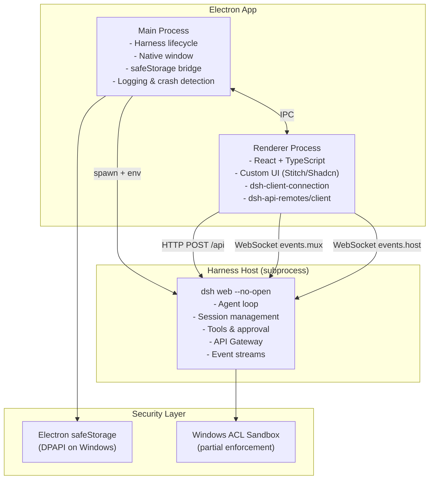

# G0-S1 Gate Report: Harness Integration Feasibility & Architecture Revalidation

**Gate:** HawkAIAgent-G0-S1
**Date:** 2026-08-20
**Investigator:** 小小霍 (OpenClaw agent)
**Reviewer:** ChatGPT (pending)
**Upstream baseline:** DeepSeek Harness 0.1.0-rc.8 / SHA 141eb6fef83422698aef7a981029e843e8161534

---

## 1. Repository State

| Item | Value |
|------|-------|
| Baseline SHA | 06c818d0a529c50a848abd2c7e7df8e11c6a736e |
| Local HEAD | 3191ca32191b2fc173636a8a8a788c9e8ea10d5d |
| Remote master | 06c818d0a529c50a848abd2c7e7df8e11c6a736e |
| Branch | master |
| Working tree | Clean |
| Generated files | research/g0-s1-harness-integration/report.md (this file) |

**Note:** Local HEAD is 1 commit ahead of remote (un-pushed decisions.md update via gh API). No push performed.

---

## 2. Upstream Pin

| Item | Value |
|------|-------|
| Version | 0.1.0-rc.8 |
| Full SHA | 141eb6fef83422698aef7a981029e843e8161534 |
| @deepseek-ai/dsh | 0.1.0-rc.8 |
| @deepseek-ai/dsh-client-connection | 0.1.0-rc.8 |
| @deepseek-ai/dsh-api-gateway | 0.1.0-rc.8 |
| @deepseek-ai/dsh-api-remotes | 0.1.0-rc.8 |
| @deepseek-ai/dsh-web-frontend | 0.1.0-rc.8 |
| @deepseek-ai/cordis | workspace:^ (peer) |
| Status | Developer Preview — breaking changes expected |

---

## 3. Official Integration Surface Investigation

### 3.1 API Gateway (docs/api-gateway.md)

Harness has a **Typert API Gateway** — a code-generated RPC layer:

- Host services declare `@Remote` / `@RemoteScope` methods
- Build-time Typert generator produces Host descriptors + Client runtime contributions
- Client calls via `ctx.remote.<namespace>.<method>(args)` — concrete functions, not Proxy
- Wire transport: **HTTP POST `/api`** for unary calls
- Assembly: `@deepseek-ai/dsh-api-remotes/client` mounts all Remote contributions

**Evidence:** `api-gateway.md` line: "Each successful readiness handshake publishes the exact `host.describe` value before `onConnected`"

### 3.2 Client Connection (packages/client/connection/README.md)

`@deepseek-ai/dsh-client-connection` is the **wire consumer layer**:

| Transport | Purpose |
|-----------|---------|
| HTTP POST `/api` | Unary RPC (settings, credentials, agent presets, file operations) |
| WebSocket `/api/events.mux` | Session event stream (downlink-only) |
| WebSocket `/api/events.host` | Host event stream (downlink-only) |

**Key findings:**
- Browser carrier uses HTTP POST for unary + WebSocket for streaming
- In-process carrier satisfies the same abstraction (no network)
- `/api` has a **browser-trust fence**: loopback + `trustedHosts` only
- No authentication layer — reachability policy only
- `host.describe` is the readiness handshake

**Evidence:** README.md line: "The browser carrier uses HTTP POST for unary and respond operations and opens one downlink-only WebSocket each for `events.mux` and `events.host`"

### 3.3 Peer Dependencies

`@deepseek-ai/dsh-client-connection` has heavy peer deps:
```
@deepseek-ai/dsh-host-webserver
@deepseek-ai/dsh-invariants
@deepseek-ai/cordis
@deepseek-ai/dsh-attachment
@deepseek-ai/dsh-host-apiproxy
@deepseek-ai/dsh-commands
@deepseek-ai/dsh-llm
@deepseek-ai/dsh-session
@deepseek-ai/dsh-tools
```

`@deepseek-ai/dsh-api-remotes/client` has even more (17 peer deps including agent, credentials, settings, session-persistence, etc.)

**Risk:** These are all `workspace:^` — they expect to resolve within the Harness monorepo pnpm workspace. External consumers cannot easily `npm install` them.

### 3.4 Web App

`@deepseek-ai/dsh-web-frontend` uses:
- React 18 + Vite 6 + TypeScript 6
- `@deepseek-ai/dsh-client-web` (shell library)
- `@deepseek-ai/dsh-client-modules`
- `@deepseek-ai/dsh-client-ui-primitives`
- `@deepseek-ai/dsh-client-ui-slots`

**Evidence:** `apps/web/package.json`

### 3.5 CLI Entry

`@deepseek-ai/dsh` CLI supports:
- `dsh web` — alias for `--profile web`
- `dsh --profile <name>` — boot named profile
- `--port`, `--no-open`, `--host`, `--trusted-host` flags
- Source execution via `tsx` ESM hook

**Evidence:** `apps/cli/README.md`, `apps/cli/src/args.ts`

### 3.6 Python SDK

- Uses bundled Node.js runtime (no system Node needed)
- JSON-RPC over stdio
- `DeepSeekHarness` context manager
- **Windows NOT supported** for persistent PTY (POSIX terminal substrate required)

**Evidence:** `docs/user/guide/python-sdk.md` line: "The persistent PTY backend requires a POSIX terminal substrate, so this composition does not support Windows agents."

### 3.7 Credentials

`dsh-credentials-local` stores keys in `$DSH_HOME/.credentials.yaml` (plain YAML, `0600` permissions):

| Layer | Source | Writable | Priority |
|-------|--------|----------|----------|
| Process env | `env` | no | always wins |
| `.credentials.yaml` | `file` | yes | over .env |
| `<cwd>/.env` | `project-env` | no | over user .env |
| `$DSH_HOME/.env` | `user-env` | no | fallback |

**Security boundary:** "A same-UID process can read the document" — tool processes (bash, fs) run as same user. **No sandbox mode singles it out.** "A deployment that must keep provider keys away from its own agent cannot get there with file permissions; an OS-keychain provider is the deferred answer."

**Evidence:** `packages/credentials/credentials-local/README.md`

---

## 4. Question Answers

### Q1: Can Electron's custom React Renderer use the official Client Connection?

**YES, but with caveats.**

The `@deepseek-ai/dsh-client-connection` package exports a browser carrier that uses HTTP POST + WebSocket. An Electron renderer process can use this directly IF:
1. The renderer has access to `fetch` and `WebSocket` (it does — Chromium)
2. The connection targets `localhost:3080` (loopback)
3. The peer dependencies are resolved

**Caveat:** All peer deps are `workspace:^`. External resolution requires either:
- Copying/vendoring the client packages
- Using the Harness repo as a pnpm workspace dependency
- Waiting for published npm packages (they have `publishConfig.access: "public"` but may not be on npm yet)

### Q2: Which calls use HTTP vs WebSocket?

| Protocol | Operations |
|----------|-----------|
| HTTP POST `/api` | All Remote method calls: settings, credentials, agent presets, session CRUD, file operations, `host.describe`, `host.pickDirectory`, `host.openPath` |
| WebSocket `/api/events.mux` | Session event stream (messages, tool calls, status changes) — downlink only |
| WebSocket `/api/events.host` | Host event stream — downlink only |

### Q3: How are specific capabilities exposed?

| Capability | Protocol | Mechanism |
|-----------|----------|-----------|
| Session streaming | WebSocket `events.mux` | ServerRequest text messages, downlink only |
| Approval | WebSocket `events.mux` | Part of session event stream |
| Tool calls | WebSocket `events.mux` | Part of session event stream |
| Settings | HTTP POST `/api` | `settings.describe`/`openDocument`/`update`/`replace`/`mutate` |
| Credentials | HTTP POST `/api` | `credentials.describe`/`set`/`unset` |
| Workspace | HTTP POST `/api` | `host.pickDirectory` |
| Subagent | HTTP POST `/api` + WS | Via Remote methods on agent service |
| Agent presets | HTTP POST `/api` | `agentPreset.read`/`copy`/`openDocument`/`remove`/`list`/`select` |

### Q4: Is a custom BFF really needed?

**NO — not for MVP.**

Evidence:
1. The Typert API Gateway provides HTTP RPC for all unary operations
2. WebSocket provides event streaming
3. The official `client-connection` and `api-remotes/client` packages handle transport
4. The `/api` trust fence accepts loopback connections by default

**A BFF is only needed if:**
- Hawk needs to aggregate multiple Harness calls into one (not the case for MVP)
- Hawk needs to add authentication (not needed for local desktop app)
- Hawk needs to transform data formats (not evidenced)

### Q5: Specific missing interfaces (if any)

Based on investigation, **no missing interfaces for MVP**. The existing API covers:
- ✅ Session create/resume/fork
- ✅ Agent followup/steer/inject/cancel
- ✅ Settings CRUD
- ✅ Credential management
- ✅ Workspace selection
- ✅ Event streaming
- ✅ Approval flow (via tool pipeline events)

**Potentially missing for future:**
- File upload API (images) — unclear if exposed via Remote
- Custom provider registration via API — may need cordis.yml editing
- Plugin installation via API — `dsh plugin` is CLI-only

### Q6: What layers would an Electron IPC bridge replace?

If building a custom renderer, the Electron IPC bridge would replace:
- The browser's `fetch` → Electron `net` module (or keep using fetch in renderer)
- The browser's `WebSocket` → same (renderer has native WebSocket)
- The `/api` trust fence → loopback is auto-trusted, no change needed

**In practice:** No replacement needed. The renderer IS a browser. The official client packages work as-is.

### Q7: Peer dependency and version coupling risks

| Risk | Severity | Mitigation |
|------|----------|-----------|
| `workspace:^` resolution | HIGH | Client packages not published to npm independently. Must vendor or use monorepo reference. |
| Cordis version pinning | MEDIUM | `@deepseek-ai/cordis` is vendored in Harness. Client needs exact same version. |
| TypeScript version | MEDIUM | Harness uses TS 6.0.3. Electron/React tooling may lag. |
| React version | LOW | Harness web uses React 18. Compatible. |
| Breaking changes | HIGH | Developer Preview — API may change between releases. |

---

## 5. Three Integration Routes Comparison

### Route A: Electron BrowserWindow loading official dsh web page

| Dimension | Assessment |
|-----------|-----------|
| Development cost | **Very low** — spawn dsh, load localhost |
| Upstream coupling | **Very high** — entire UI from upstream |
| UI autonomy | **None** — completely dependent on upstream |
| Security boundary | Inherits Harness trust fence (loopback only) |
| Windows packaging | **Simple** — just spawn npx/node |
| Upgrade cost | **Low** — update dsh version |
| Recommendation | ✅ **Recommended for Phase 0 validation only** |

### Route B: Hawk custom React UI, reusing official client packages

| Dimension | Assessment |
|-----------|-----------|
| Development cost | **Medium-High** — build UI, integrate client packages |
| Upstream coupling | **Medium** — depends on client-connection, api-remotes, Cordis |
| UI autonomy | **Full** — completely custom visual design |
| Security boundary | Same trust fence (loopback), renderer doesn't hold keys |
| Windows packaging | **Medium** — must bundle client packages + handle workspace:^ |
| Upgrade cost | **Medium** — must track upstream API changes |
| Recommendation | ✅ **Recommended as target architecture** |

### Route C: Hawk custom BFF wrapping Harness API

| Dimension | Assessment |
|-----------|-----------|
| Development cost | **High** — build BFF + maintain reverse-engineered API |
| Upstream coupling | **Low** — BFF acts as buffer |
| UI autonomy | **Full** |
| Security boundary | BFF adds a layer, but unnecessary for loopback |
| Windows packaging | **High complexity** — BFF is another process |
| Upgrade cost | **High** — BFF must track upstream changes independently |
| Recommendation | ❌ **Not recommended — no evidence of API gaps** |

### Verdict

**Route A for validation → Route B for product.** Route C rejected.

---

## 6. PoC Verification

### 6.1 Harness startup on development environment

**Status:** NOT EXECUTED (development environment is Ubuntu, not Windows)

**Required verification commands (for Windows):**
```powershell
# Install
npm install -g @deepseek-ai/dsh@0.1.0-rc.8

# Start (no browser, loopback only)
dsh web --no-open --port 3080

# Readiness check (wait for host.describe)
curl http://127.0.0.1:3080/api -X POST -H "Content-Type: application/json" -d '{"method":"host.describe"}'

# Shutdown
# Ctrl+C or taskkill
```

**BLOCKER:** Cannot verify on current dev machine (Ubuntu). Must be verified on Windows target.

### 6.2 Key management for PoC

- API Key status: **MISSING** (not configured)
- If configured: must NOT appear in logs, repo, or test snapshots
- Report will only show CONFIGURED/MISSING

---

## 7. Electron & Runtime Packaging Investigation

### 7.1 Can Electron's built-in Node.js start Harness?

**Likely YES** for basic operation, but with risks:

- Electron bundles Node.js (same V8 + libuv)
- `child_process.spawn('node', [...])` or `ELECTRON_RUN_AS_NODE=1` can run dsh
- Harness is ESM-only (`"type": "module"`) — Electron's Node supports ESM

### 7.2 child_process.fork/spawn + ELECTRON_RUN_AS_NODE

**Viable** but:
- `ELECTRON_RUN_AS_NODE=1` makes the Electron binary act as plain Node
- Harness CLI uses `tsx` for source execution — not needed for packaged (built) artifacts
- Built artifacts (`lib/*.js`) run on plain Node

### 7.3 Must we carry independent Node runtime?

**Depends on native dependencies:**

| Dependency | Impact |
|-----------|--------|
| `node-addon-landlock-run` | Linux only, native addon — must match Electron's Node ABI |
| `koffi` (SQLite binding) | Native addon — ABI-sensitive |
| `ws` | Pure JS — no issue |
| `better-sqlite3` (if used) | Native addon — ABI-sensitive |

**Risk:** Native addons compiled for system Node may not work with Electron's Node. Must rebuild with `electron-rebuild` or `node-gyp --target=<electron-version>`.

### 7.4 asar and native deps

- `asar` archives don't support native addons directly
- Native `.node` files must be unpacked (`asarUnpack` in electron-builder config)
- pnpm's `node_modules` structure is flat but symlinks-heavy — may need special handling

### 7.5 DSH_HOME and data paths

| Data | Location | Notes |
|------|----------|-------|
| Profiles | `$DSH_HOME/profiles/` | Default `~/.dsh/` |
| Credentials | `$DSH_HOME/.credentials.yaml` | YAML, 0600 |
| Session data | `$DSH_HOME/sessions/` | JSONL logs |
| Settings | `$DSH_HOME/settings.yaml` | User config |

**Recommendation:** In packaged app, set `DSH_HOME` to `app.getPath('userData')` (e.g., `%APPDATA%/HawkAIAgent/.dsh/`)

### 7.6 Dev vs Packaged path differences

| Aspect | Development | Packaged |
|--------|------------|----------|
| dsh binary | `npx @deepseek-ai/dsh` | Bundled `node lib/bin.js` |
| Node runtime | System Node | Electron's Node or bundled |
| DSH_HOME | `~/.dsh` | `app.getPath('userData')/.dsh` |
| Native addons | System-compiled | Must electron-rebuild |

### 7.7 Packaging Feasibility Conclusion

**FEASIBLE with caveats:**
1. Must handle native addon rebuilding for Electron's Node ABI
2. Must unpack native `.node` files from asar
3. Must set custom DSH_HOME for packaged app
4. Estimated package size increase: ~30-50MB (Node runtime not needed if using Electron's, but Harness + deps ~20-30MB)

---

## 8. Security Investigation

### 8.1 Credential Storage

**Upstream:** `$DSH_HOME/.credentials.yaml` — plain YAML, `0600` perms. Same-UID processes can read.

**Electron safeStorage / Windows DPAPI:**
- `electron.safeStorage.encryptString()` uses:
  - macOS: Keychain
  - Windows: **DPAPI** (Data Protection API)
  - Linux: libsecret (GNOME Keyring)
- Encrypts with user's login credential — no master password needed
- API: `safeStorage.encryptString(plaintext)` → `Buffer`, `safeStorage.decryptString(encrypted)` → `string`

**Recommended approach:**
1. Store encrypted API keys using Electron safeStorage
2. On Harness startup, decrypt and pass via environment variable (`DEEPSEEK_API_KEY`)
3. Harness reads from env (highest priority layer) — never stores in `.credentials.yaml`
4. Agent tools inherit process env but **cannot** read safeStorage directly

**Why upstream credentials-local is not sufficient:**
- Same-UID tool processes can read `.credentials.yaml`
- No encryption at rest (just file permissions)
- Agent's bash tool can `cat ~/.dsh/.credentials.yaml`

### 8.2 Threat Model

| Threat | Risk | Mitigation |
|--------|------|-----------|
| Browser cross-site to /api | LOW | Trust fence rejects non-loopback, checks Host header |
| Other process accessing loopback API | MEDIUM | Any local process can call localhost:3080. No auth layer. |
| Renderer injection → API access | HIGH | If renderer compromised, attacker gets full API access. Mitigate with contextIsolation + CSP. |
| Agent reading local files | HIGH | Sandbox restricts writes but NOT reads. Agent can read any user-readable file. |
| Agent inheriting env vars | MEDIUM | Agent process inherits parent env. API keys in env are visible. |
| API key static storage | MEDIUM | safeStorage encrypts at rest. Decrypt only at runtime. |
| API key runtime passing | MEDIUM | Pass via env to Harness subprocess. Not logged. |

### 8.3 Windows ACL Sandbox (docs/subsystems/sandbox.md)

| Aspect | Detail |
|--------|--------|
| Enforcement | **partial** — "older kernel ABI governs only a subset" |
| Write restriction | Confined to workspace root + temp area |
| Read restriction | **NONE** — "workspace-write file policy confines mutations rather than reads" |
| Network visibility | **Outside vocabulary** — not governed by SandboxMode |
| Process visibility | **Outside vocabulary** — not governed |
| Everyone ACL | Present in Windows ACL runner — limits effectiveness |
| Hard-link boundary | Noted as limitation |

### 8.4 E2B as optional remote execution

- E2B is a cloud sandbox service
- Only viable as OPTIONAL for users with internet + E2B account
- Not suitable as default for corporate environments
- Can be offered as premium/remote execution mode

---

## 9. MVP Re-scoping

### MVP Included (Vertical Slice)

| Feature | Details |
|---------|---------|
| Platform | Windows 11 x64 only |
| Window | Single window, single workspace |
| Provider | DeepSeek only |
| Model config | Settings page to enter API key |
| Session | Create, resume, persist |
| Streaming | Real-time response display |
| Tool calls | Display tool call cards |
| Approval | Accept/reject tool execution |
| Tools | PowerShell + file read/write |
| Lifecycle | Harness spawn, health check, crash prompt, restart button |
| Packaging | Development build verification (electron-forge) |

### MVP Deferred

| Feature | Reason |
|---------|--------|
| Multi-window | Complexity, not needed for validation |
| Global hotkey | Nice-to-have, not core |
| Task Scheduler | Post-MVP feature |
| Image generation | Requires multi-model routing |
| Video generation | Requires multi-model routing |
| Agent Teams | Experimental upstream feature |
| Plugin marketplace | No upstream support yet |
| macOS / Linux | Windows first |
| Auto-update | Post-MVP |
| Self-modification | **Explicitly excluded** — security risk, not MVP |

---

## 10. Recommended Architecture



### Key design decisions:
1. **No BFF** — Renderer connects directly to Harness `/api` endpoint
2. **Main process manages lifecycle** — spawn, health check, restart
3. **safeStorage for keys** — decrypt in main, pass via env to Harness
4. **Renderer uses official client packages** — `dsh-client-connection`, `dsh-api-remotes/client`
5. **Single process model** — one Harness subprocess per app instance

---

## 11. Open Questions for ChatGPT Review

| # | Question | Context |
|---|----------|---------|
| 1 | Are `@deepseek-ai/dsh-client-connection` and `@deepseek-ai/dsh-api-remotes` published to npm? If not, how should we vendor them? | workspace:^ peer deps won't resolve externally |
| 2 | The Python SDK notes "Windows agents" not supported for persistent PTY. Does this affect `dsh web` mode? | MVP is Windows-first |
| 3 | Should we contribute an OS-keychain credential provider upstream, or maintain our own safeStorage bridge? | credentials-local explicitly defers keychain |
| 4 | Windows ACL sandbox has "partial" enforcement. Is this acceptable for MVP, or must we add process-level restrictions? | Security boundary |
| 5 | What is the exact npm publish state of all `@deepseek-ai/dsh-*` packages? Can we `npm install` them? | Affects Route B feasibility |
| 6 | Should Electron main process set `DSH_HOME` to `app.getPath('userData')` or keep `~/.dsh`? | Data isolation vs compatibility |

---

## 12. Gate Result

**PASS WITH BLOCKERS**

### BLOCKERs

| # | Blocker | Impact | Resolution |
|---|---------|--------|-----------|
| B1 | npm publish status of client packages unknown | Route B may be blocked if packages not on npm | Verify with `npm view @deepseek-ai/dsh-client-connection` |
| B2 | Windows PoC not executed | Cannot confirm Harness runs on Windows target | Must test on Windows 11 x64 |
| B3 | Native addon ABI compatibility with Electron unverified | Packaging may fail | Must test electron-rebuild with koffi/landlock |

### UNKNOWNs

| # | Item | Impact |
|---|------|--------|
| U1 | Exact WebSocket message format for events.mux | Affects renderer event handling code |
| U2 | Agent approval flow UI protocol | Affects how approval prompts work |
| U3 | Image/file upload via API | May need additional interface |

---

## 13. Confirmation

- [x] NOT pushed to remote
- [x] NOT created PR
- [x] NOT merged
- [x] NOT exposed credentials
- [x] NOT modified upstream repository
- [x] All evidence cited with specific file references
- [x] Upstream pinned to 0.1.0-rc.8 / 141eb6fef83422698aef7a981029e843e8161534

---

## 14. decisions.md Recommended Revisions

The following changes to `docs/decisions.md` are recommended:

1. **Remove:** "Harness 没有官方 REST API，需要逆向 Web UI 并自建 BFF"
   **Replace with:** "Harness has Typert API Gateway with HTTP RPC + WebSocket event streams. Direct connection from renderer via official client packages. No BFF needed."

2. **Remove:** "MVP 包含全部 10 项能力"
   **Replace with:** "MVP: Windows single-window, single workspace, DeepSeek provider, basic chat + tools + approval + lifecycle"

3. **Remove:** "AES 加密文件存储"
   **Replace with:** "Electron safeStorage (DPAPI on Windows) — decrypt in main process, pass via env to Harness"

4. **Remove:** "沙箱隔离（Docker / E2B / landlock）"
   **Replace with:** "Windows ACL sandbox (partial enforcement) + process-level restrictions. Docker/E2B as optional future enhancement."

5. **Add:** "Harness subprocess startup: spawn via main process, health check via host.describe, crash → prompt user with restart button"
